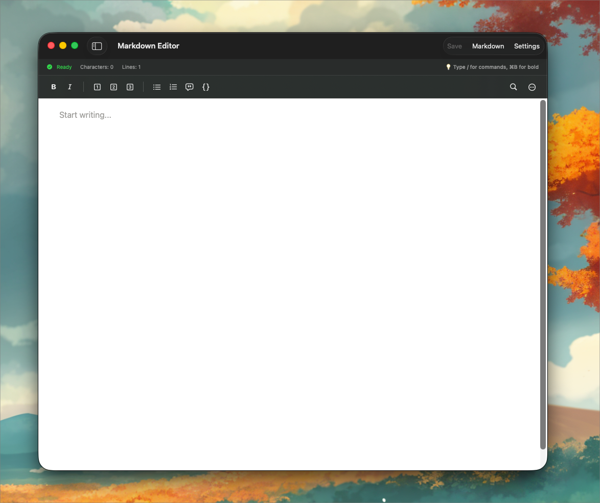

# SlipboxEditor - Swift WYSIWYG Rich Text Editor for iOS & macOS

> ⚠️ **Work in Progress** - This project is currently under active development. Features and APIs may change as we continue building and refining the editor.




**SlipboxEditor** is a powerful Swift Package that provides a **WYSIWYG rich text editor** for iOS and macOS applications. Built with **Swift 6.2**, **WKWebView**, and **Quill.js**, it offers seamless **JavaScript interoperability** and **native performance** for modern SwiftUI and UIKit apps.

**Perfect for:** Content management systems, note-taking apps, document editors, blogging platforms, messaging apps, and any iOS/macOS application requiring advanced text editing capabilities.

## Features & Capabilities

- 📝 **Rich Text Editing**: Complete WYSIWYG editor with text formatting, bulleted/numbered lists, images, links, tables, and advanced typography
- 🚀 **Native iOS/macOS Performance**: Leverages WKWebView and JavaScriptCore for optimal rendering speed and memory efficiency
- 📱 **Cross-Platform Swift Package**: Universal compatibility with iOS 26.0+, macOS 26.0+, SwiftUI, and UIKit applications
- 🔄 **Type-Safe Swift-JavaScript Bridge**: Structured message passing with Codable support for reliable interoperability
- 💾 **Offline-First Architecture**: Zero network dependencies with bundled assets for consistent performance
- 🎯 **SwiftUI Native Integration**: Drop-in view component with @StateObject and @ObservableObject support
- ⌨️ **Keyboard Shortcuts**: Full keyboard navigation and shortcuts for power users
- 🎨 **Customizable UI**: Themeable interface with CSS customization support
- 📤 **Multiple Export Formats**: HTML, plain text, and structured data export options
- 🔧 **Programmatic Control**: Comprehensive API for automation and custom workflows

## Technical Requirements

- **iOS 26.0+** / **macOS 26.0+** - Modern platform support
- **Swift 6.2+** - Latest Swift language features and performance improvements
- **Xcode 16.0+** - Compatible with latest development tools
- **SwiftUI** / **UIKit** - Works with both UI frameworks
- **WKWebView** support - Core web rendering technology

## Installation & Setup

### Swift Package Manager

Add SlipboxEditor to your project using Xcode:

1. File → Add Package Dependencies
2. Enter the repository URL: `https://github.com/slipboxai/slipbox-editor`
3. Select the version or branch
4. Add to your target

Or add it to your `Package.swift`:

```swift
dependencies: [
    .package(url: "https://github.com/yourusername/slipbox-editor", from: "1.0.0")
]
```

## Quick Start Guide

### Basic SwiftUI Integration

The simplest way to add a rich text editor to your iOS or macOS app:

```swift
import SwiftUI
import SlipboxEditor

struct ContentView: View {
    var body: some View {
        SlipboxEditorView()
            .frame(minHeight: 400)
    }
}
```

### Advanced SwiftUI Implementation with Programmatic Control

For full control over the WYSIWYG editor with custom toolbars and state management:

```swift
import SwiftUI
import SlipboxEditor

struct ContentView: View {
    @StateObject private var editorModel = SlipboxEditorModel()
    
    var body: some View {
        VStack {
            // Custom formatting toolbar
            HStack {
                Button("Bold") {
                    Task {
                        try? await editorModel.executeCommand(
                            SlipboxEditorCommand(action: .bold, data: nil)
                        )
                    }
                }
                .disabled(!editorModel.isReady)
                
                Button("Save Document") {
                    let state = editorModel.saveState()
                    // Persist to Core Data, CloudKit, or file system
                }
                
                Spacer()
            }
            .padding()
            
            // Rich text editor view
            SlipboxEditorView()
                .environmentObject(editorModel)
        }
    }
}
```

## Complete API Reference

### SlipboxEditorView - SwiftUI Component

The primary SwiftUI view component that embeds the rich text editor in your app:

```swift
public struct SlipboxEditorView: View
```

**Usage:** Drop-in SwiftUI view for instant WYSIWYG editing functionality.

### SlipboxEditorModel - Observable State Manager

The core model class providing programmatic control over the rich text editor:

```swift
@MainActor
public class SlipboxEditorModel: ObservableObject {
    @Published public var htmlContent: String        // Real-time HTML content
    @Published public var plainText: String          // Stripped plain text
    @Published public var isReady: Bool              // Editor initialization state
    @Published public var selectedRange: NSRange?    // Current text selection
    
    // Async command execution for text formatting
    public func executeCommand(_ command: SlipboxEditorCommand) async throws
    
    // Content management methods
    public func setContent(_ html: String) async throws
    public func getContent() async throws
    
    // State persistence for document management
    public func saveState() -> SlipboxEditorState
    public func restoreState(_ state: SlipboxEditorState) async throws
}
```

### SlipboxEditorCommand - Text Formatting Actions

Comprehensive command system for programmatic text formatting and editor control:

```swift
public struct SlipboxEditorCommand: Codable {
    public enum Action: String, Codable {
        // Text formatting commands
        case bold, italic, underline, strike
        
        // Content insertion commands  
        case insertText, insertImage, insertLink
        
        // Document management
        case setContent, getContent
        
        // Layout and alignment
        case format, align
        
        // Undo/redo functionality
        case undo, redo
        
        // List creation
        case insertList, insertOrderedList
        
        // Heading styles
        case heading1, heading2, heading3
        
        // Block formatting
        case blockquote, codeBlock
    }
    
    public let action: Action
    public let data: [String: AnyCodable]?    // Optional parameters for commands
}
```

### Common Text Editing Commands

Essential commands for implementing rich text editing functionality:

```swift
// Text formatting commands
try await model.executeCommand(SlipboxEditorCommand(action: .bold, data: nil))
try await model.executeCommand(SlipboxEditorCommand(action: .italic, data: nil))

// Content insertion with parameters
try await model.executeCommand(SlipboxEditorCommand(
    action: .insertText, 
    data: ["text": AnyCodable("Hello World")]
))

// Image embedding (base64 or URL)
try await model.executeCommand(SlipboxEditorCommand(
    action: .insertImage,
    data: ["src": AnyCodable("data:image/jpeg;base64,...")]
))

// HTML content management
try await model.setContent("<p>Your HTML content here</p>")

// Heading and structure commands
try await model.executeCommand(SlipboxEditorCommand(action: .heading1, data: nil))
try await model.executeCommand(SlipboxEditorCommand(action: .insertList, data: nil))
```

## Technical Architecture

SlipboxEditor implements a modern hybrid architecture optimized for iOS and macOS development:

### Core Technologies
- **WKWebView** - High-performance web rendering engine for UI display
- **WKScriptMessageHandler** - Bidirectional Swift ↔ JavaScript communication bridge
- **JavaScriptCore** - Direct JavaScript execution for advanced scenarios
- **Quill.js** - Proven rich text editing engine with extensive formatting support

### Architecture Benefits
- **Native iOS/macOS Performance** - No WebAssembly overhead, pure native execution
- **Platform Integration** - Full access to iOS/macOS APIs and system features  
- **Type-Safe Interoperability** - Structured Swift-JavaScript communication using Codable
- **Offline-First Design** - Zero network dependencies with bundled web assets
- **Memory Efficient** - Optimized resource usage for mobile and desktop environments
- **Swift Concurrency Support** - Modern async/await patterns throughout the API

## Customization & Theming

### Custom SwiftUI Toolbar Implementation

Create your own formatting toolbar while leveraging the editor's programmatic API:

```swift
SlipboxEditorView()
    .toolbar(.hidden) // Hide default toolbar for custom implementation
    .overlay(alignment: .top) {
        MyCustomToolbar(model: editorModel)
    }
```

### CSS Styling and Theme Customization

Apply custom themes and styling through JavaScript CSS injection:

```swift
let customCSS = """
    .ql-editor { 
        font-family: 'SF Mono', monospace; 
        background: #f8f8f8; 
        border-radius: 8px;
        padding: 16px;
    }
    .ql-toolbar {
        border: none;
        background: linear-gradient(to right, #667eea 0%, #764ba2 100%);
    }
"""

editorModel.evaluateCustomScript("document.head.insertAdjacentHTML('beforeend', '<style>\(customCSS)</style>')")
```

### Dark Mode Support

Implement system-responsive dark mode themes for your rich text editor:

```swift
@Environment(\.colorScheme) var colorScheme

let darkModeCSS = colorScheme == .dark ? """
    .ql-editor {
        background-color: #1c1c1e;
        color: #ffffff;
    }
""" : ""
```

## Demo Application & Examples

Experience SlipboxEditor's full capabilities with our comprehensive demo application:

### Running the iOS/macOS Demo App

#### Option 1: Xcode Development
1. Clone this repository
2. Open `Examples/Package.swift` in Xcode
3. Select the `SlipboxEditorDemo` scheme  
4. Press ⌘R to run on iOS Simulator or macOS

#### Option 2: Swift Command Line
```bash
cd Examples/
swift run SlipboxEditorDemo
```

### Demo Features & Capabilities

The demo app showcases real-world implementation patterns:

- 📝 **Document Management System**: Create, save, and load multiple rich text documents
- 🛠️ **Complete Formatting Toolbar**: All WYSIWYG editing options with keyboard shortcuts
- 📄 **HTML Source Export**: View and copy the generated HTML markup
- ⚙️ **Settings & Configuration Panel**: Explore features, shortcuts, and customization options
- 💾 **Sample Documents**: Pre-loaded content demonstrating various formatting capabilities
- 🎨 **Theme Switching**: Light/dark mode support with custom CSS themes
- 💿 **Persistence Integration**: Examples of Core Data and file system integration

## Use Cases & Implementation Examples

### Common iOS/macOS App Integration Scenarios

SlipboxEditor is perfect for various application types:

**📱 Note-Taking Apps**: Bear, Notion-style editors with rich formatting
**📝 Content Management**: Blog editors, documentation tools, wiki systems  
**💬 Messaging Platforms**: Rich text messaging with formatting support
**📖 Document Editors**: Word processor alternatives for iOS/macOS
**🎓 Educational Apps**: Interactive content creation and markup tools
**💼 Business Apps**: Report generation, proposal creation, documentation

### Sample Projects & Code Examples

The `Examples/` directory contains production-ready implementations:

- **SlipboxEditorDemo**: Complete demo application with document management, persistence, and theming
- **Integration Patterns**: SwiftUI, UIKit, Core Data, and CloudKit examples
- **Custom Toolbar Examples**: Advanced formatting controls and keyboard shortcuts
- **Theme System**: Light/dark mode with custom CSS styling implementations

## Contributing

Contributions are welcome! Please read our [Contributing Guide](CONTRIBUTING.md) for details on our code of conduct and the process for submitting pull requests.

## License

This project is licensed under the MIT License - see the [LICENSE](LICENSE) file for details.

## Acknowledgments

- Built on top of [Quill.js](https://quilljs.com/) - An amazing rich text editor
- Inspired by the research on Swift 6.2+ JavaScript interoperability enhancements
- Thanks to the Swift community for feedback and contributions

## Keywords & Search Terms

**Primary**: Swift WYSIWYG editor, iOS rich text editor, macOS text editor, SwiftUI editor component, WKWebView editor
**Secondary**: JavaScript Swift interop, Quill.js Swift, cross-platform editor, rich text editing Swift, WYSIWYG Swift package
**Technical**: WKScriptMessageHandler, JavaScriptCore Swift, Swift 6.2 JavaScript, iOS text formatting, macOS rich text
**Use Cases**: Swift note app, iOS document editor, macOS word processor, SwiftUI text editor, mobile rich text

## Support & Community

If you encounter any issues or have questions:

1. 📚 Check the [comprehensive documentation](https://github.com/yourusername/slipbox-editor/wiki)
2. 🔍 Search [existing issues](https://github.com/yourusername/slipbox-editor/issues) and discussions
3. 🆕 Create a [new issue](https://github.com/yourusername/slipbox-editor/issues/new) with detailed information
4. 💬 Join our [community discussions](https://github.com/yourusername/slipbox-editor/discussions) for tips and best practices

## Performance & Compatibility

- **✅ iOS 26.0+** - Full feature support with modern SwiftUI
- **✅ macOS 26.0+** - Native macOS integration with AppKit interoperability  
- **✅ Swift 6.2+** - Leverages latest language features and concurrency model
- **⚡ Optimized Performance** - Minimal memory footprint, 60fps scrolling
- **🔄 Backward Compatible** - Works with existing UIKit and AppKit applications

---

Made with ❤️ for the Swift community | Perfect for iOS & macOS rich text editing needs